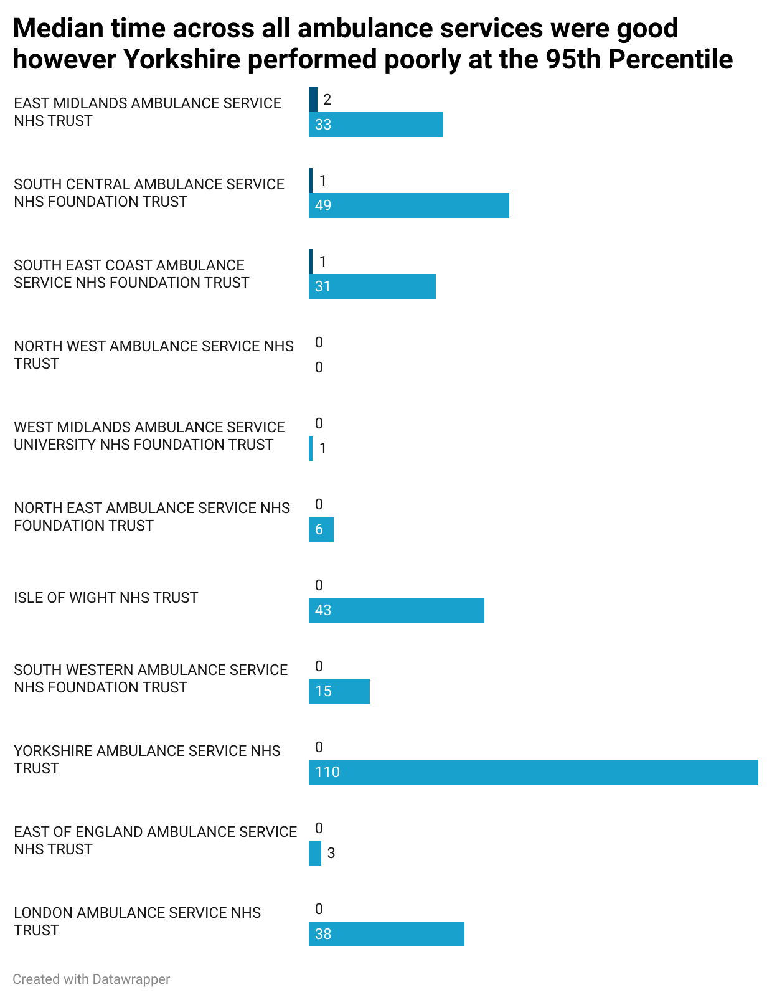

# Project Background
### Introduction
This report provides a data-driven analysis of UK Ambulance Service call handling performance for the month of September 2025. 

During this project I stored the dataset on Google BigQuery and Queried the data from there when needed. 
- The SQL Queries I used can be found [here](sql/queries.txt)
#### Objective
This analysis is conducted primarily for **UK Ambulance Service Trusts**, **NHS England**, **Regional Health Bodies**, and **National Regulators**.

The primary goal is to provide these stakeholders with an evidence-based assessment of overall service demand and operational efficiency across all ambulance services and regions for September 2025. The focus is on evaluating key performance indicators for call answer times (**A3, A4, A5, A114, A6**) to highlight performance achievements and identify areas of **operational stress**.

#### Data Overview
The analysis utilizes a national dataset containing call metrics (A0-A6, A114, A124-A125), stratified by individual ambulance service and region.

#### Critical Data Caveat: Time Series Comparability
The time series analysis is limited by changes in the official data specification. Data collected before **October 2023** was subject to different measurement rules (the 20190912 specification) so I won't use it in this analysis.

# Executive Summary
National performance is characterized by a critical dilema: while $50\%$ of calls are answered almost instantaneously (Median time $\mathbf{0}$ minutes since December 2024), the system remains severely vulnerable during demand spikes. A strong correlation confirms that increased Contact Volume (A0) directly leads to prolonged 95th Centile ($\mathbf{A5}$) delays. In particular month of December represents a high risk period for extreme delays with its higher Contact Volume.

Critically, the Yorkshire Ambulance Service (YAS) recorded a significant regional outlier, with a $\mathbf{95^{\text{th}}\ Centile\ (A5)}$ answer time of $\mathbf{110\ minutes}$ in September 2025, indicating a localized systemic failure in managing peak demand.

### Insights Deep Dive
#### 1) Contact Volume and Call Answer time
- Is there a correlation between the volume of contacts ($\text{A0}$) and the change in the 95th centile call answer time ($\text{A5}$)?

There is a strong correlation between the volume of calls and the 95th percentile call answer time suggests that when the system is under stress it is a lot more likely that the 95th percentile answer time will increase.

The information about the correlation and this graph shows that we should be specially aware of the winter months, in particular december since in the Year 2024 it had the peak contact amount (1.3 Million) and the second highest on the graph was December 2023 which was less (1.2 Million).

- Question: What is the difference between the Median ($\text{A4}$) and the 95th centile ($\text{A6}$) answer times, and how does this difference vary between trusts?

In Sept 2025, the median call answer time was great going to a maximum of 2 and mostly 0's for each ambulance service however there is a cause of concern for Yorkshire who's 95th Percentile stands out vididly compared to the other trusts.

- Question: What is the change in the different percentiles other time for call answer time, mean and median?

The national Trend for ambulance answer times has been good, it is good to see that December 2023 99th percentile which was 125 dropped to 94 in 2024. Also that the 95th Percentile in 2023 December which was 65, dropped to 43 in 2024 December.
The mean answer time has shown a steady decrease over time, the median has been at 0 nationally since December 2024.

#### Recommendations

1) Be cautious about the winter season, particulary the month december. The data shows a correlation between increased Contact Count and Call Answer Times (95th Percentile). Increasing resources during that time period would help the NHS ambulance service have better performance at its worse.

2) Investigate Yorkshire ambulance for their 95th Percentile. Yorkshire had an extrememly high call answer time at the 95th percentile at 110 minutes. To ensure that they perform better at their worst looking at what happened during 2025 may lead to discoveries that can help prevent it from happening again.

3) Recommendation: Conduct an in-depth root cause analysis for the months where A6 spiked. Investigate whether these peaks are correlated with:
- Specific seasonal events (like the December festive period, as highlighted).
- Unexpected staff shortages or surge demand.
- System failures or infrastructure bottlenecks (e.g., IT, telephony).

A possible solution could be to implement a contingency staffing and capacity plans specifically designed to "cap" the maximum wait time, aiming to keep the A6 line below a set target (e.g., 90 minutes) even during peak demand periods.

#### Thoughts
The dataset is huge I am sure I can add more on to this as time goes on It would be interesting if in the future I could write a program to update the database with new data when it is released as well as the visuals.

